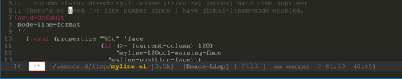

# MyDots

Personal dot files

## Emacs

### init.el

Emacs conf all in one file

* Define some keys
* Backups
* UI settings
* [use-package](https://github.com/jwiegley/use-package)
* [MultiMarkdown](http://fletcherpenney.net/multimarkdown/) for multiple platforms

<kbd>M-x package-install RET [monokai-theme](https://github.com/oneKelvinSmith/monokai-emacs) RET</kbd>

<kbd>M-x package-install RET [markdown-mode](https://github.com/jrblevin/markdown-mode) RET</kbd>

### myline.el
Mode line configuration.
Faces are mainly copied from [Amit](http://amitp.blogspot.fi/2011/08/emacs-custom-mode-line.html).

Format:

	column status user-login-name@system-name:directory/filename [filesize] vc-mode [modes] date time (uptime)

I have `global-linum-mode` enabled in `init.el` so myline does not show line numbers.

## Git

### .gitconfig

* Use `emacs` as defaut editor
* Mercurial style `in` and `out` aliases
* Pretty log

### .gitignore

Basic ignore patterns for SVN, Eclipse, Netbeans, Idea, Emacs and so on...

## Mercurial

### .hgrc

* Use `emacs` as default editor
* Lots of extensions
* Status aliases for queues
